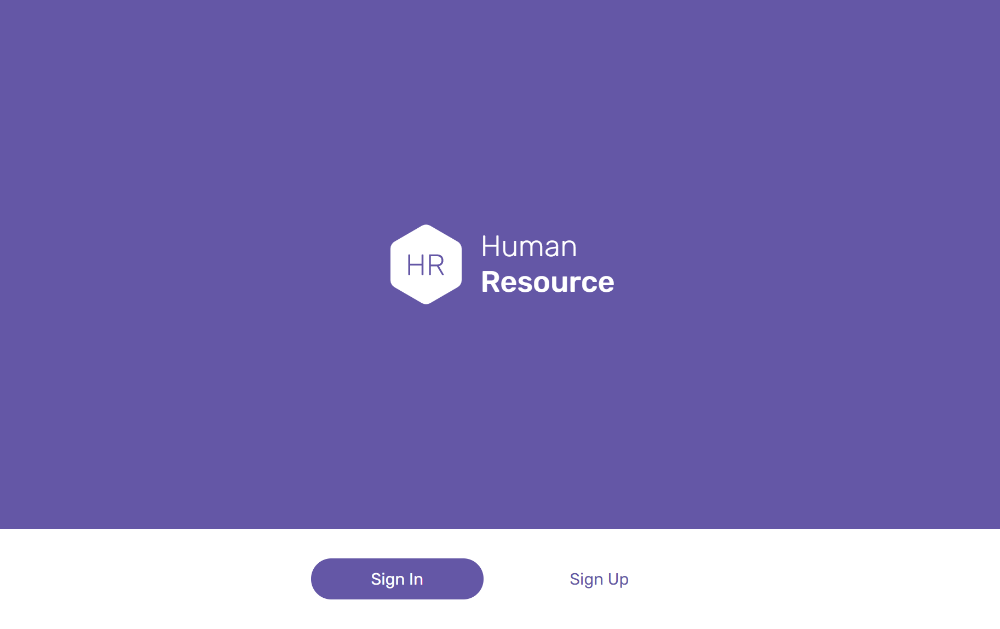

# Human Resource App

## Table of contents

- [Overview](#overview)
  - [Screenshot](#screenshot)
  - [Links](#links)
- [My process](#my-process)
  - [Built with](#built-with)
- [Author](#author)

## Overview

### Screenshot

### Links

- Live Site URL: [https://cv-severnyuk-aleksey.github.io/human-resource-app/](https://cv-severnyuk-aleksey.github.io/human-resource-app/)

## My process

### Built with

Server part:
- [Express JS](https://expressjs.com/) - JS library
- [SQLite](https://www.sqlite.org/) - SQL database engine

Client part:
- Semantic HTML5 markup
- SCSS
- Flexbox
- CSS Grid
- Mobile-first workflow
- [Preact](https://preactjs.com/) - JS library
- [Webpack](https://webpack.js.org/) - JS module bundler

## Author

- Website - [cv-severnyuk-aleksey](https://github.com/cv-severnyuk-aleksey)